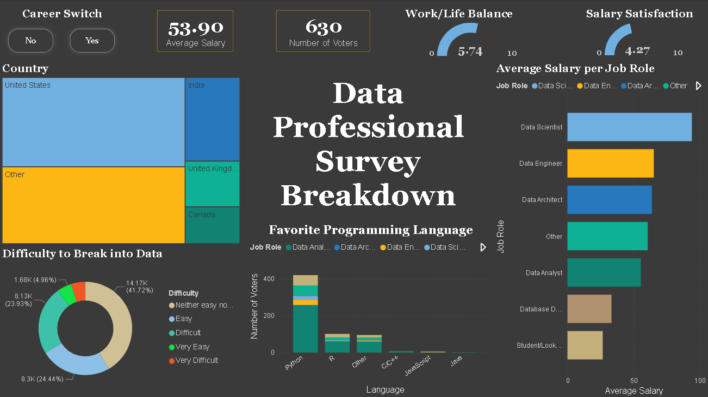

# Data Professional Survey Dashboard

A Power BI dashboard analyzing 630 survey responses from data professionals across salary, job roles, programming language preferences, and entry difficulty into the data field.

---

## Dashboard Preview

---

## Dataset

- **File:** `Power BI -Project 1.xlsx`
- **Respondents:** 630 data professionals
- **Key fields:** Job role, country, salary, programming language preference, work/life balance rating, salary satisfaction rating, career switch status, difficulty to break into data

---

## KPI Summary (All Respondents)

| Metric | Value |
|---|---|
| Average Salary | $53.90K |
| Total Respondents | 630 |
| Work/Life Balance (out of 10) | 5.74 |
| Salary Satisfaction (out of 10) | 4.27 |

---

## Dashboard Sections

### Career Switch Slicer (Yes / No)
Filters the entire dashboard by whether the respondent switched careers to enter data. Toggling between Yes and No updates all KPIs and visuals for a direct group comparison.

### Country Breakdown (Treemap)
The United States is the largest respondent group, followed by India, the United Kingdom, and Canada. A sizable "Other" bucket indicates global reach beyond these four countries.

### Difficulty to Break into Data (Donut Chart)
| Difficulty Level | Count | Share |
|---|---|---|
| Neither easy nor difficult | 14.17K | 41.72% |
| Difficult | 8.3K | 24.44% |
| Easy | 8.13K | 23.93% |
| Very Easy | 1.68K | 4.96% |
| Very Difficult | remainder | — |

### Favorite Programming Language (Stacked Bar by Job Role)
Python dominates across all roles by a large margin. R is a distant second, with stronger representation among Data Scientists. C/C++, JavaScript, and Java have minimal presence in data roles.

### Average Salary by Job Role (Horizontal Bar)
Ranked highest to lowest:
1. Data Scientist
2. Data Engineer
3. Data Architect
4. Data Analyst
5. Database Developer
6. Student / Looking

---

## Key Insight: Career Switchers vs. Non-Switchers

| Metric | Switched (Yes) | Did Not Switch (No) |
|---|---|---|
| Respondents | 258 | 372 |
| Average Salary | $52.58K | $54.82K |
| Work/Life Balance | 5.71 / 10 | 5.77 / 10 |
| Salary Satisfaction | 4.14 / 10 | 4.36 / 10 |

Career switchers earn slightly less (~$2.2K gap) and report lower salary satisfaction than those who entered data directly. Work/life balance scores are comparable across both groups. The salary gap is modest, but the satisfaction gap suggests switchers feel the pay difference relative to their expectations.

---

## Tools Used

| Tool | Purpose |
|---|---|
| Power BI Desktop | Dashboard design and interactivity |
| Power Query | Data cleaning and transformation |
| Excel | Source data |

---

## Files

| File | Description |
|---|---|
| `project.pbix` | Full Power BI dashboard |
| `Power BI -Project 1.xlsx` | Raw survey dataset |
| `data_prof_survey.png` | Dashboard screenshot |

---

## How to Open

1. Install [Power BI Desktop](https://powerbi.microsoft.com/desktop/) (free)
2. Clone this repo or download `project.pbix`
3. Open the file — data is embedded, no external connection needed
