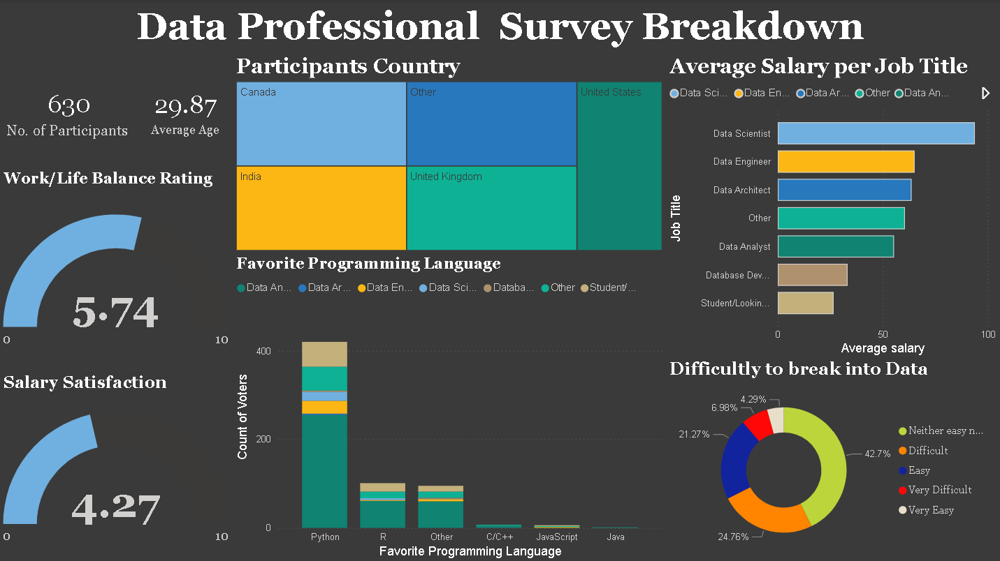

# Data Professional Survey Dashboard

## Overview

This project analyzes survey responses from 630 participants to understand salary trends, job roles, and entry barriers in the data industry.

## Key Insights

* Data Scientists have the highest average salaries, followed by Data Engineers and Data Architects
* Work-life balance averages at **5.74/10**, while salary satisfaction is lower at **4.27/10**
* **42.7% of respondents** reported neutral difficulty in breaking into data careers
* Python is the most preferred programming language among respondents

## Dashboard Preview

## Tools Used

* Power BI
* Data Cleaning & Transformation
* Data Visualization

## Files

* `.pbix` file for full dashboard
* Screenshot for quick preview
